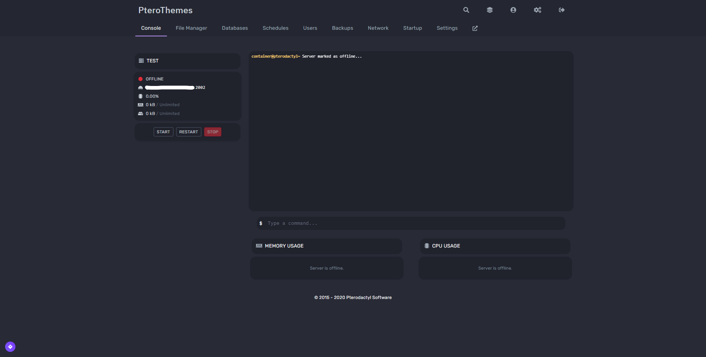

## Enola - 1.2.0, 1.2.1, and 1.2.2
Instructions to install the theme Enola are here
[Enola 1.2.2(Latest Panel Version)](https://github.com/Lellee/Ptero-Themes-v1/tree/master/latest/Enola)

## Twilight - 1.1.3, 1.2.0, 1.2.1, 1.2.2
Instructions to install the theme Twilight are here
[Enola 1.2.2(Latest Panel Version)](https://github.com/Lellee/Ptero-Themes-v1/tree/master/latest/Twilight)

## Recolor - 1.2.0, 1.2.1, 1.2.2
This theme is a recolor of the panel that you can edit, more information here
[Recolor](https://github.com/Lellee/Ptero-Themes-v1/tree/master/latest/Recolor)

## Dracula - 1.2.0, 1.2.1, 1.2.2
This theme is a recolor of the panel that you can edit, more information here
[Dracula 1.2.2(Latest Panel Version)](https://github.com/Lellee/Ptero-Themes-v1/tree/master/latest/Dracula)

## If you have suggestions or issues dm me on discord, Lellis#9405
